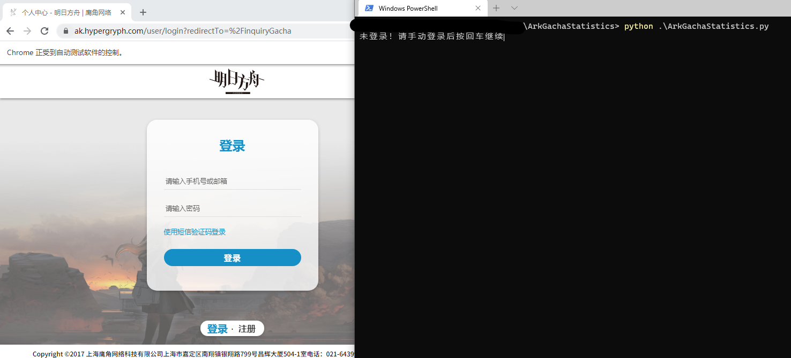
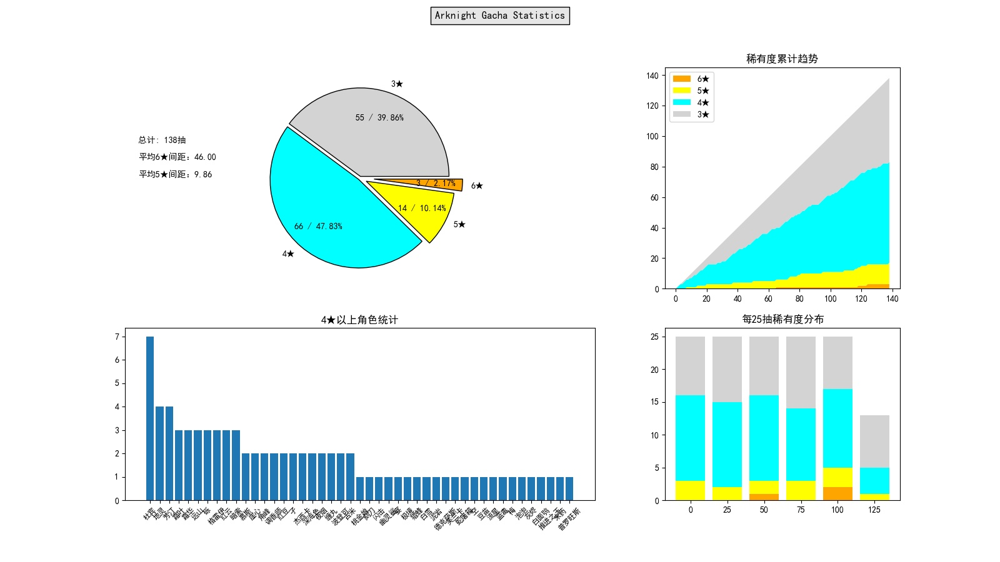

# Arknights Gacha Statistics
一个练手用的明日方舟抽卡统计工具 - 基于python+selenium+chrome

## 效果展示
- 登录

- 自动获取数据

- 本地log文件

- 生成图片


## 基本思路 & BB
1. 用浏览器打开[官网页面](https://ak.hypergryph.com/user/inquiryGacha)，手动登录+通过验证码
2. 获取官网抽卡统计表格，获得抽卡时间和角色名，通过分析class获得稀有度，以字典列表的形式存储
3. 检测下一页是否存在，存在则进入
4. 我好菜，轻喷qwq
5. 测试环境：Windows10, python3.6.8, Chrome89.0.4389.90

## 使用方法
1. 安装Google Chrome浏览器(89)，python
   - 如果使用Chrome浏览器其他版本(浏览器访问[chrome://settings/help](chrome://settings/help)查看版本号)，请自行[下载对应版本的chromedriver](http://npm.taobao.org/mirrors/chromedriver/)替换本项目文件夹中的`chromedriver.exe`
   - 其他浏览器暂不支持，如果您能适配，欢迎PR
2. 命令行运行`pip install -r requirements.txt`安装依赖。
3. 命令行运行`python ArkGachaStatistics.py`执行主程序。~~似乎直接双击即可正常运行？~~ 可选参数：
```
usage: ArkGachaStatistics.py [-h] [-r] [-s] [--skip-draw] [-e]
  -h, --help            show this help message and exit
  -d, --debug           输出调试信息.
  -e, --export          直接从已有数据导出图片.
  -f filename, --file filename
                        设置记录的文件名(默认为log.json).
  -r, --reset           清除历史记录.
  -s, --skip-fetch      跳过从官网更新抽卡数据.
  --skip-draw           跳过画图.
```
4. 输入账户名和密码登录后按回车继续。
5. **注意**：本程序依赖[官网数据](https://ak.hypergryph.com/user/inquiryGacha)，而它只保存**30日，100条以内**数据，且查询结果可能与游戏内实际操作存在延迟。若您希望获得较为完整的数据，请确保在每个30天，100抽内至少运行一次（程序会自动抛弃重复的数据）

## Change log
- 2021-03-31 高星干员分布和每25抽稀有度分布柱状图，中文显示，-f指定log文件名（如果需要获取多个账户的数据请使用此功能）
- 2021-03-29 绘制稀有度分布堆叠折线图，argparse参数解析
- 2021-03-28 创建项目，获取数据以及绘制稀有度分布饼图

## TO-DO
- ......